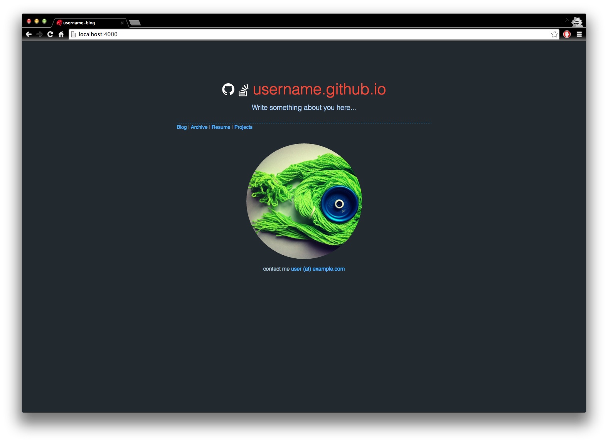
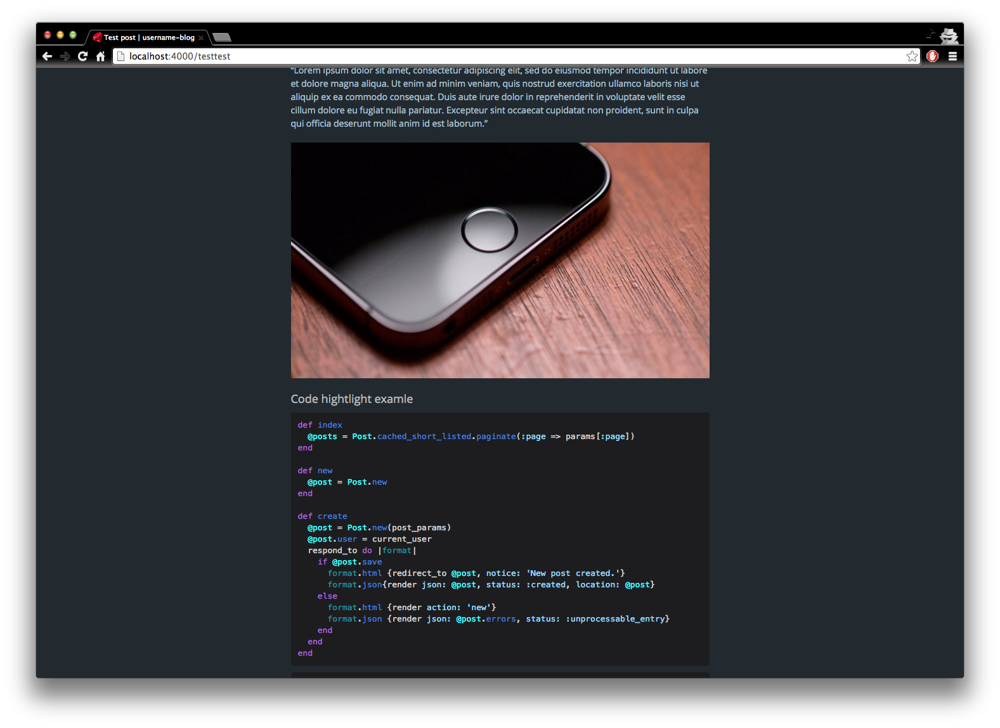

# Autm-rb

Another theme for jekyll.

## [DEMO][demo]

## Customization

Edit **_config.yml** and files inside **_data/** before using

## Screens

## Licensing

[MIT](https://github.com/railsr/autm-rb/blob/master/LICENSE)

[pages]: http://pages.github.com
[fork]: https://github.com/railsr/autm-rb/fork
[demo]: http://kirqe.github.io/autm-rb/
